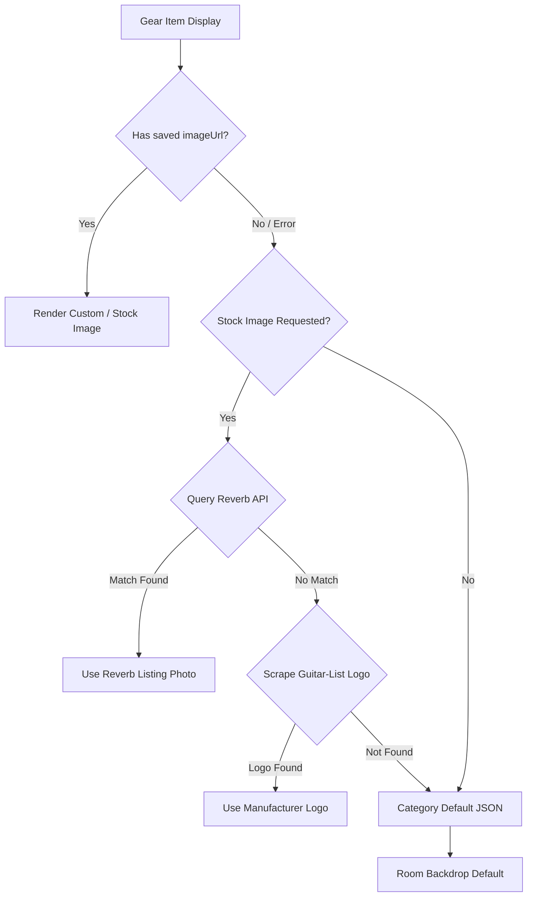

# Gear Image Generation, Sources, and Fallback Pipeline

This document explains how images for gear items are fetched, generated, uploaded, and displayed in the **Gearhed / Rigistry** application, based on `frontend/.env.local` and codebase inspection.

> **Note**: Gear images are **not procedurally or AI-generated dynamically**. Instead, the application retrieves images through a multi-tiered pipeline of external API searches, web scraping, user uploads, and local static fallbacks.

---

## 1. Reverb.com API (Primary Gear Stock Photos)

* **Environment Variables**: `REVERB_API_TOKEN` in [`frontend/.env.local`](file:///c:/Users/rob_b/gearhed/frontend/.env.local#L32-L34)
* **Key Files**: 
  * [`frontend/src/app/api/stock-image/route.ts`](file:///c:/Users/rob_b/gearhed/frontend/src/app/api/stock-image/route.ts)
  * [`frontend/src/lib/reverb.ts`](file:///c:/Users/rob_b/gearhed/frontend/src/lib/reverb.ts)
  * [`frontend/src/app/gear/add/page.tsx`](file:///c:/Users/rob_b/gearhed/frontend/src/app/gear/add/page.tsx)

### How It Works:
1. When a user enters a **Brand** and **Model** (plus optional **Color**) and clicks **"Fetch Stock Image"**, the Next.js API route (`/api/stock-image`) queries Reverb's listings endpoint:
   `https://api.reverb.com/api/listings?query={brand}+{model}`
2. Reverb listing titles are scored to favor exact gear matches while penalizing listings that mention accessories or bundles (e.g., "case", "cable", "manual", "bundle").
3. The API selects the highest resolution photo (`large` > `full` > `medium` > `thumbnail`).
4. If the returned image is not ideal, users can click **"Try Again"** in the UI to cycle through alternative listing photos using `pickIndex`.

---

## 2. Cloudinary (User Custom Image Uploads)

* **Environment Variables**:
  * `NEXT_PUBLIC_CLOUDINARY_CLOUD_NAME="dfkt03pao"`
  * `NEXT_PUBLIC_CLOUDINARY_UPLOAD_PRESET="unsigned-rigistry"`
  * `CLOUDINARY_API_KEY`, `CLOUDINARY_API_SECRET`, `CLOUDINARY_URL`
* **Key Files**:
  * [`frontend/src/lib/cloudinary.ts`](file:///c:/Users/rob_b/gearhed/frontend/src/lib/cloudinary.ts)
  * [`frontend/src/components/CloudinaryUploader.tsx`](file:///c:/Users/rob_b/gearhed/frontend/src/components/CloudinaryUploader.tsx)

### How It Works:
1. Users can upload custom photos directly from their device.
2. The frontend sends unsigned POST requests to Cloudinary's upload API (`https://api.cloudinary.com/v1_1/{cloudName}/auto/upload`) using the specified upload preset.
3. The returned `secure_url` is saved directly to the Firestore gear document (`g.imageUrl`).

---

## 3. Guitar-List Web Scraping (Manufacturer Brand Logos)

* **Key Files**:
  * [`frontend/src/app/api/brand-logo/route.ts`](file:///c:/Users/rob_b/gearhed/frontend/src/app/api/brand-logo/route.ts)
  * [`frontend/src/lib/brandAliases.ts`](file:///c:/Users/rob_b/gearhed/frontend/src/lib/brandAliases.ts)

### How It Works:
1. If Reverb returns no matching stock images or the user clicks **"Use Manufacturer"**, the system attempts to fetch a brand logo.
2. The brand name is normalized into a slug (with special alias overrides such as `PRS` -> `paul-reed-smith-guitars-prs`, `B.C. Rich` -> `bc-rich`, `G&L` -> `gl`).
3. The backend scrapes `https://www.guitar-list.com/brands/{slug}` and parses the HTML using **Cheerio**.
4. It inspects `` elements for logo indicators (preferring SVG/PNG formats and filename/alt text matches), proxies the binary image content, and caches the result for performance.

---

## 4. Logo.dev API (Brand Logos Integration)

* **Environment Variables**:
  * `NEXT_PUBLIC_LOGO_DEV_PUBLISHABLE_KEY`
  * `LOGO_DEV_SECRET_KEY`
* **Key Files**:
  * [`frontend/src/lib/logoDev.ts`](file:///c:/Users/rob_b/gearhed/frontend/src/lib/logoDev.ts)

### How It Works:
1. Helper functions (`buildLogoDevImageUrl`) build requests targeting `img.logo.dev/name/{brand}` using the publishable key.
2. If no publishable API key is configured in the environment, it generates a fallback inline SVG data-URI watermark showing the brand text.

---

## 5. Static Local Category & Room Placeholders

* **Asset Files & Config**:
  * [`frontend/public/brand-defaults-by-kind.json`](file:///c:/Users/rob_b/gearhed/frontend/public/brand-defaults-by-kind.json)
  * [`frontend/Kind to default pictures.txt`](file:///c:/Users/rob_b/gearhed/frontend/Kind%20to%20default%20pictures.txt)
  * [`frontend/public/branding/`](file:///c:/Users/rob_b/gearhed/frontend/public/branding/) (e.g., `Guitar backdrop.png`, `Bass gear brand default.png`, `Keyboard gear brand default.png`, `Studio gear brand default.png`)
* **Key Files**:
  * [`frontend/src/app/rigistry/RoomGearList.tsx`](file:///c:/Users/rob_b/gearhed/frontend/src/app/rigistry/RoomGearList.tsx)

### How It Works:
If no custom image or stock image is found, the component resolves images using a strict sequential fallback order:
1. **`imageUrl`**: Saved user upload (Cloudinary) or chosen stock image URL.
2. **`detailDefault`**: Instrument sub-kind match (e.g., `trumpet` mapped to brass default).
3. **`kindDefault`**: Category lookup in `brand-defaults-by-kind.json` based on `g.kind` (e.g., guitar, bass, drums, synth, microphone).
4. **`roomDefault`**: Studio room backdrop based on room key (e.g., `guitar-amp`, `drum`, `control`, `synthzone`, `dj-booth`).

---

## Complete Image Resolution Pipeline

